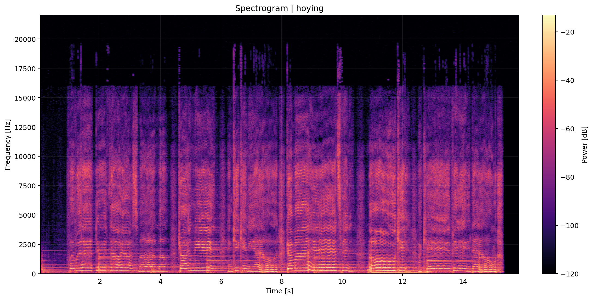
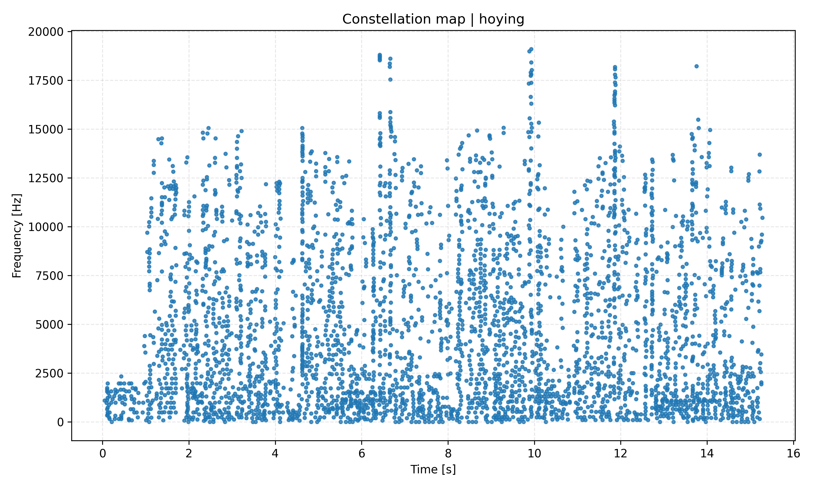
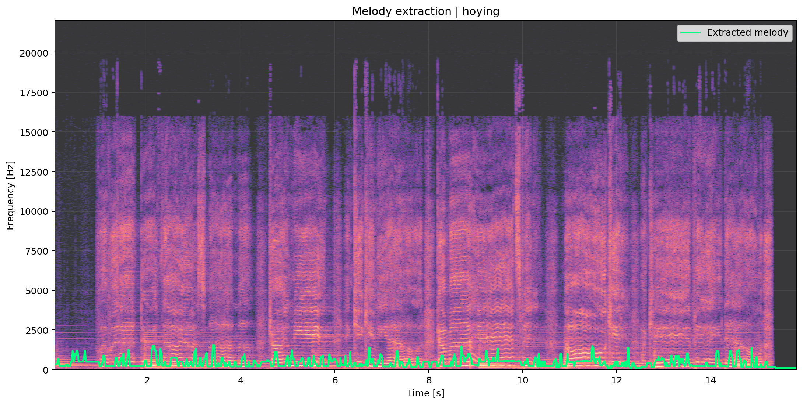
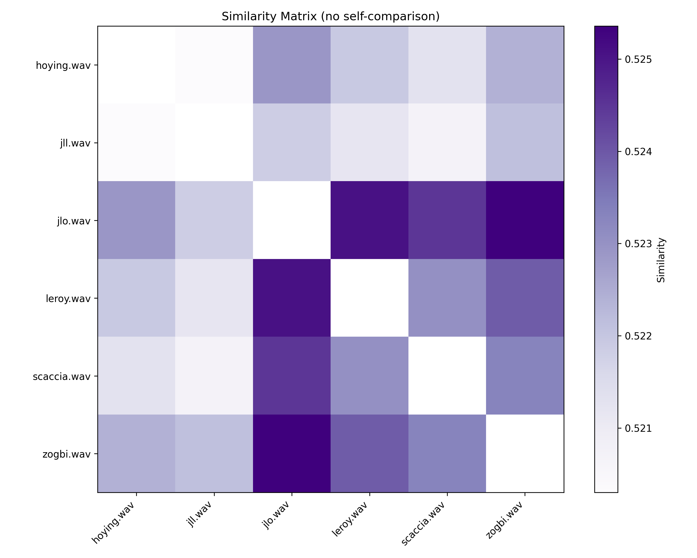

# SpectroMap

SpectroMap is a Python package for melodic similarity analysis directly from audio signals using a constellation-based representation. It transforms WAV files into robust spectral peak maps, extracts melodic contours, normalizes them for tempo and transposition invariance, and computes pairwise similarity using a kernelized pseudodistance.

The project is designed for reproducible MIR workflows and structured for GitHub and PyPI distribution.

---

## What it does

Given a folder of `.wav` files, SpectroMap will:

1. load and normalize audio,
2. compute a log-power spectrogram,
3. detect robust local spectral peaks,
4. build constellation maps,
5. extract a continuous melody contour,
6. normalize pitch and time,
7. compare all pairs of fragments,
8. generate plots and similarity tables.

---

## Key improvements over the original prototype

- adaptive peak detection with local and global thresholding
- melody extraction via spectral ridge continuity
- log-frequency representation
- transposition invariance via pitch normalization
- tempo invariance via time normalization and resampling
- stabilized and symmetrized pseudodistance
- CLI for batch processing
- structured outputs for reproducibility

---

## Project structure

```text
spectromap/
├── data/
│   └── input_audio/
├── outputs/
│   ├── constellations/
│   ├── plots/
│   │   ├── constellations/
│   │   ├── melody/
│   │   └── spectrograms/
│   └── results/
├── examples/
├── src/
│   └── spectromap/
├── tests/
├── figures/
├── README.md
├── pyproject.toml
├── .gitignore
├── LICENSE
└── MANIFEST.in
```

---

## Visual Results

This section illustrates the core stages of the SpectroMap pipeline, from raw spectral representation to similarity computation.

### Spectrogram

<p align="center">
  
</p>

The log-power spectrogram represents the time–frequency energy distribution of the signal. Harmonic structures and temporal evolution are clearly visible, forming the basis for peak detection.

---

### Constellation Map

<p align="center">
  
</p>

The constellation map is a sparse representation of salient spectral peaks. It removes redundant information while preserving the structural backbone of the signal.

---

### Melody Extraction

<p align="center">
  
</p>

The extracted melodic contour follows dominant spectral trajectories while enforcing temporal continuity, yielding a robust representation of melodic identity.

---

### Similarity Matrix

<p align="center">
  
</p>

The similarity matrix summarizes pairwise relationships between all audio fragments. Diagonal elements are excluded to enhance contrast and highlight inter-sample structure.

---

## Installation

### Local development

```bash
pip install -e .
```

### Standard installation

```bash
pip install .
```

---

## Quick start

Place your WAV files inside:

```text
data/input_audio/
```

Then run:

```bash
spectromap compare --input-dir data/input_audio --output-dir outputs
```

---

## Example CLI

```bash
spectromap compare \
  --input-dir data/input_audio \
  --output-dir outputs \
  --fft-size 4096 \
  --hop-size 512 \
  --min-frequency 80 \
  --max-frequency 2000 \
  --resample-length 128 \
  --save-plots
```

---

## Output files

The pipeline generates:

- `pairwise_distances.csv`
- `pairwise_similarities.csv`
- `ranked_similarities.csv`

The ranked file provides the most interpretable output, sorting pairs from most to least similar.

---

## Similarity model

SpectroMap implements a kernelized pseudodistance with the following properties:

- uses all temporal points
- incorporates full feature space
- handles unequal sequence lengths
- applies Gaussian temporal weighting
- enforces symmetry

Final similarity is defined as:

```text
similarity = 1 / (1 + distance)
```

---

## Python API example

```python
from pathlib import Path
from spectromap.config import SpectroMapConfig
from spectromap.pipeline import SpectroMapPipeline


def main() -> None:

    ROOT = Path(__file__).resolve().parents[1]
    input_dir = ROOT / "data" / "input_audio"
    output_dir = ROOT / "outputs"

    config = SpectroMapConfig(
        fft_size=4096,
        hop_size=512,
        min_frequency=80.0,
        max_frequency=2000.0,
        resample_length=128,
        adaptive_threshold_db=6.0,
        save_plots=True,
    )

    pipeline = SpectroMapPipeline(config=config)

    results = pipeline.compare_directory(
        input_dir=input_dir,
        output_dir=output_dir,
        save_plots=True,
    )

    print(results[["file_a", "file_b", "similarity"]].to_string(index=False))
```

---

## Paper

A detailed mathematical and methodological description of SpectroMap is provided in the accompanying paper:

López-García, A., Martínez-Rodríguez, B., & Liern, V. (2022, June). A proposal to compare the similarity between musical products. one more step for automated plagiarism detection?. In International Conference on Mathematics and Computation in Music (pp. 192-204). Cham: Springer International Publishing.
[https://doi.org/10.1007/978-3-031-07015-0_16]

## Preparing a release for PyPI

```bash
python -m build
```


## Notes on invariance

This implementation improves robustness across performances through:

- log-frequency pitch representation
- median-based pitch centering
- time normalization to $[0,1]$
- fixed-length contour resampling

---

## Author

Brian Martínez-Rodríguez

GitHub: https://github.com/BrianComposer

Email: info@brianmartinez.music

Web: www.brianmartinez.music


## License

MIT